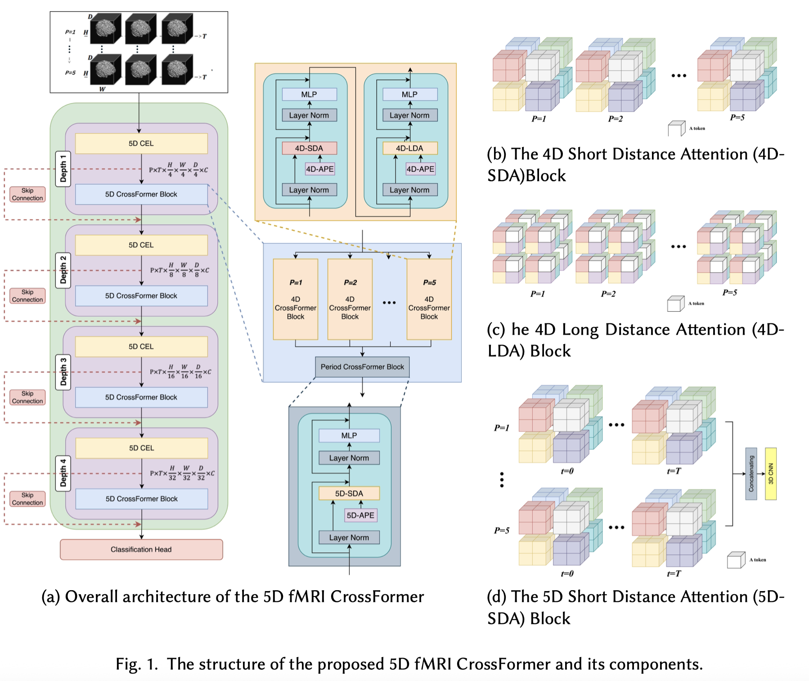
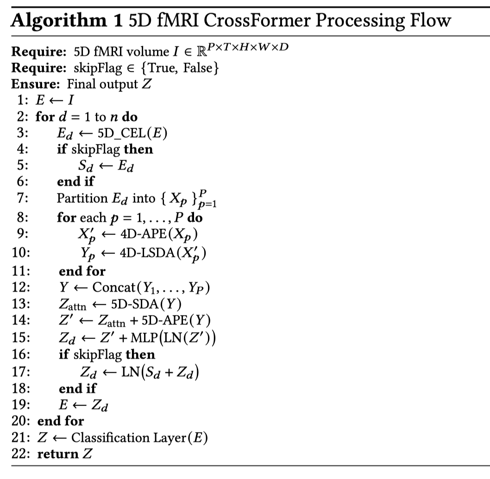
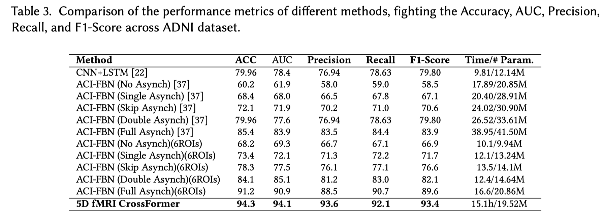
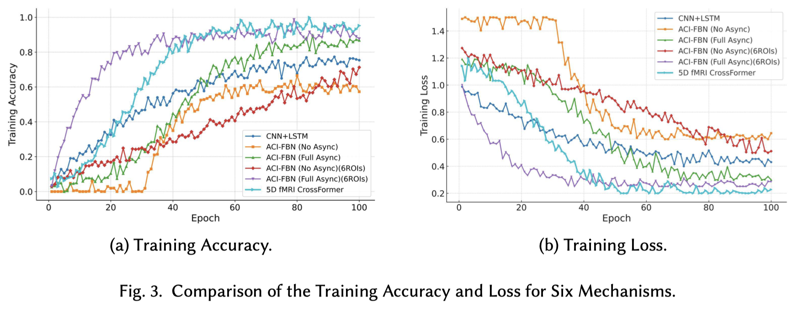
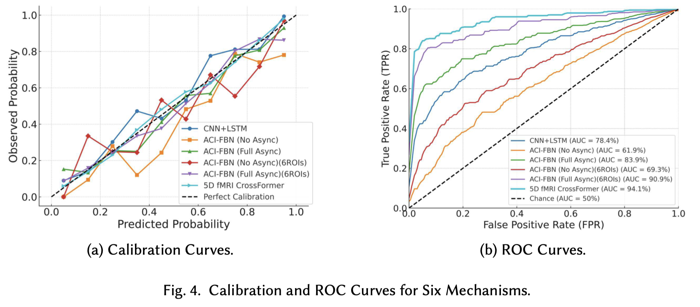

# 5D fMRI CrossFormer for medical analysis (5DfCF)
5D Transformer Architecture for Joint temporal and Spatial Attentions of Timeseries 4D fMRI Images


## Overview

Traditional neuroimaging approaches often treat fMRI volumes as independent time-points, overlooking the rich temporal dynamics present in longitudinal scans. **5D fMRI CrossFormer** introduces a novel five-dimensional architecture that:

- Embeds multi-scale spatial patches across both intra-session and inter-session dimensions.
- Applies dedicated 4D and 5D attention mechanisms to capture both local and global spatiotemporal dependencies.
- Seamlessly integrates period-aware positional embeddings to preserve the order of semiannual scans.
- Offers two variants (Base and Tiny) to balance performance and computational cost.

In experiments on longitudinal fMRI data from the Alzheimer’s Disease Neuroimaging Initiative (ADNI), the full model achieves **94.3% accuracy** and **94.1% AUC**, outperforming state-of-the-art baselines by 3–10 points in key metrics :contentReference[oaicite:0]{index=0}.

---

## Key Features

- **5D Cross-Scale Embedding Layer (5D-CEL):** Parallel 3D convolutions with multiple kernel sizes embed each fMRI volume into a unified token representation (see Fig. 2).
- **4D CrossFormer Block:** Dual‐path self-attention (4D-SDA for local windows and 4D-LDA for long-range dependencies) combined with absolute positional embeddings ensures rich intra-session feature extraction.
- **Period CrossFormer Block (PCB):** 5D short-distance attention (5D-SDA) fuses period-specific outputs from the 4D blocks, enhanced by period positional embeddings to capture inter-session evolution.
- **Variants:**
    - **Base:** Higher token dimensions and deeper layers for maximum accuracy.
    - **Tiny:** Reduced depth and channel sizes for 20% fewer parameters and 23% faster training, while still achieving 90.8% accuracy.

---

## Figures

### Fig. 1. Model Architecture
  
**Description:**  
The overall structure of the 5D fMRI CrossFormer. Four depths alternate between a **5D Cross-Scale Embedding Layer (5D-CEL)**—which applies parallel 3D convolutions at multiple scales to embed each period–time volume into tokens—and a **5D CrossFormer Block** that fuses period-wise 4D attention with global 5D short-distance attention. Skip-connections carry intermediate embeddings forward, and a final classification head aggregates the last set of tokens into diagnostic predictions.

---

### Fig. 2. Processing Flow (Algorithm 1)
  
**Description:**  
Step-by-step pipeline of the 5D fMRI CrossFormer:
1. **Input** raw 5D volume \(I \in \mathbb{R}^{P\times T\times H\times W\times D}\).
2. For each depth \(d\):
    - **5D-CEL** embeds \(E_{d-1}\) into multi-scale tokens \(E_d\).
    - **Partition** \(E_d\) into period-specific tensors \(\{X_p\}_{p=1}^P\).
    - On each \(X_p\): add 4D absolute positional embeddings (4D-APE), then apply either **4D Short-Distance Attention (4D-SDA)** or **4D Long-Distance Attention (4D-LDA)**.
    - **Concat** period outputs \(\{Y_p\}\), then perform **5D-SDA**, residual MLP with LayerNorm, and optional skip-connection fusion.
3. **Classification layer** transforms the final embedding into output logits \(Z\).

---

### Fig. 3. Performance Comparison (Table 3)
  
**Description:**  
Comparison of methods on the ADNI dataset:
- **Accuracy & AUC:** Our 5D CrossFormer reaches **94.3%** accuracy and **94.1** AUC, outperforming CNN+LSTM (79.96%/78.4) and all ACI-FBN variants.
- **Precision, Recall, F1-Score:** Achieves **93.6%** precision, **92.1%** recall, and **93.4%** F1-score—demonstrating balanced class performance.
- **Efficiency:** Training time of **15.1 h** and **19.52 M** parameters remain competitive versus heavier baselines.

---

### Fig. 4. Training Accuracy & Loss (Fig. 3)
  
**Description:**
- **(a) Training Accuracy:** The CrossFormer (cyan) converges rapidly—surpassing other methods by epoch 40—and plateaus near **0.95**.
- **(b) Training Loss:** Exhibits a steep early decline and stabilizes around **0.2**, indicating effective feature learning and regularization.

---

### Fig. 5. Calibration & ROC Curves (Fig. 4)
  
**Description:**
- **(a) Calibration Curves:** Predicted probabilities of the CrossFormer closely align with the perfect calibration line, indicating reliable confidence estimates.
- **(b) ROC Curves:** With an **AUC of 0.941**, our model outperforms all baselines, achieving higher true positive rates across false positive thresholds and demonstrating superior discriminative power.


---

## Datasets

We leveraged the Alzheimer’s Disease Neuroimaging Initiative (ADNI) longitudinal fMRI cohort:

| Dataset | sMCI | pMCI | Total |
|---------|:----:|:----:|:-----:|
| **Unbalanced** | 190 |  55  |  245  |
| **Balanced**   | 190 | 180  |  370  |

- **Stable MCI (sMCI):** Subjects whose diagnoses remained “MCI” across all visits.
- **Progressive MCI (pMCI):** Subjects whose diagnoses converted from “MCI” to “Dementia” at any follow-up.
- **Preprocessing:** Exclude single-visit subjects; impute missing annual scans via nearest available timepoint; balance classes using SMOTE. 

---

## Installation & Usage

```bash
git clone https://github.com/InfoLab-SKKU/5DfCF.git
cd 5d-fmri-crossformer
pip install -r requirements.txt
```

## Repository Structure
```
5DfCF/
├── configs/
│   ├── 5DfCF/
│   └── 5DfCF_pp/
├── data/
│   └── csv_data/
│       ├── adni_csv_final/
│       ├── adni_csv_fmri_processed/
│       ├── new_adni_processed/
│       ├──PPMI_csv_data/
│       ├── ADNI_dementia_only_rids_with_ptid.csv
│       ├── ADNI_filtered_data.csv
│       ├── ADNI_mci_only_rids_with_ptid.csv
│       ├── ADNI_pMCI_rids_with_ptid.csv
│       ├── adni_sorted_unique_ptids.txt
│       ├── adni_unique_ptids.txt
│       ├── ADNIMERGE_12Dec2024.csv
│       ├── ADNIMERGE_with_labels_sorted.csv
│       ├── ADNIMERGE_with_labels.csv
│       └── chris_5D_fmri_adni_progression_12_31_2024.csv
├── models/
│   ├── 5DfCF.py
│   ├── build.py
│   ├── Crossformer.py
│   └── utils/
│       ├── data_preprocess_and_load/
│       ├── __init__.py
│       ├── data_module.py
│       ├── losses.py
│       ├── lr_scheduler.py
│       ├── metrics.py
│       ├── neptune_utils.py
│       ├── parser.py
│       └── seed_creation.py
├── readme_files/
├── csv_file.ipynb
├── LICENSE
└── README.md
```

## Installation

```bash
# 1. Clone the repository
git clone https://github.com/your-org/5DfCF.git
cd 5DfCF
```

### 2. (Optional) Create and activate a Python virtual environment
```bash
python3 -m venv venv
```

### 3. Install dependencies
```bash
pip install -r requirements.txt
```

### If you don’t have a requirements.txt, install core packages manually
```bash
pip install torch torchvision numpy pandas scikit-learn pyyaml
```


## Usage

### 1. Data Preparation

Ensure your CSV files are placed under `data/csv_data/adni_csv_final/`, for example:
```text
data/csv_data/adni_csv_final/ADNI_filtered_data.csv
````

### 2. Preprocessing & Dataset Setup

```bash
python models/build.py \
  --config configs/5DfCF/config.yaml \
  --data_root data/csv_data/adni_csv_final
```

### 3. Training

```bash
python models/5DfCF.py \
  --config configs/5DfCF/config.yaml \
  --output_dir checkpoints/ \
  --epochs 100 \
  --batch_size 16
```

### 4. Evaluation / Inference

```bash
python models/Crossformer.py \
  --checkpoint checkpoints/best_model.pth \
  --data_root data/csv_data/adni_csv_final \
  --mode eval
```


